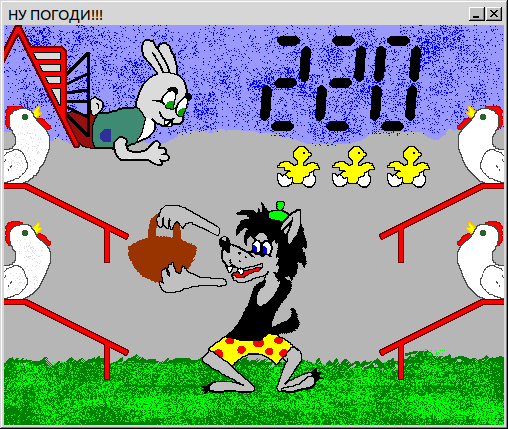

Ну погоди!
============

Любимая игрушка в любом компьютере, в котором установлена Java SE версии 1.6 или новее. Игра управляется клавиатурой:

- Пауза - клавиша пробела.
- **F** - волк ловит слева вверху
- **V** - снизу слева
- **J** - правый верхний
- **N** - снизу справа

Лицензия
------------

Код игры распространяется на условиях `Apache License, Version 2.0`.  
Однако в игре используются следующие компоненты, чья лицензия неизвестна:

- Файл `src/main/java/game/SoundEffect.java` был взят по адресу http://www3.ntu.edu.sg/home/ehchua/programming/java/J8c_PlayingSound.html и незначительно изменен.
- Звуки в папке `src/main/resources/sound/` были взяты из проекта https://github.com/mgrebenets/aneggs
- Изображения в папке `files/` кроме файла `screen-shot.png` имеют неизвестное происхождение.

